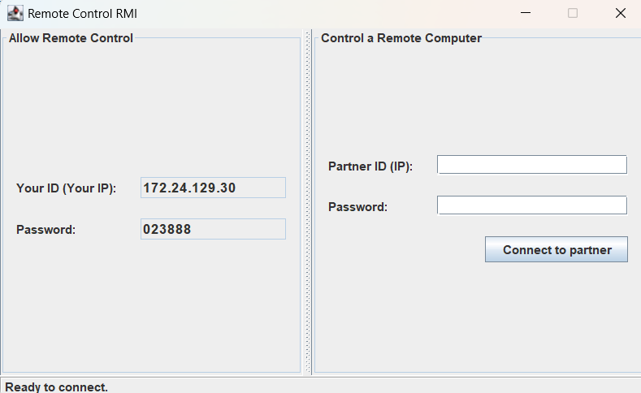
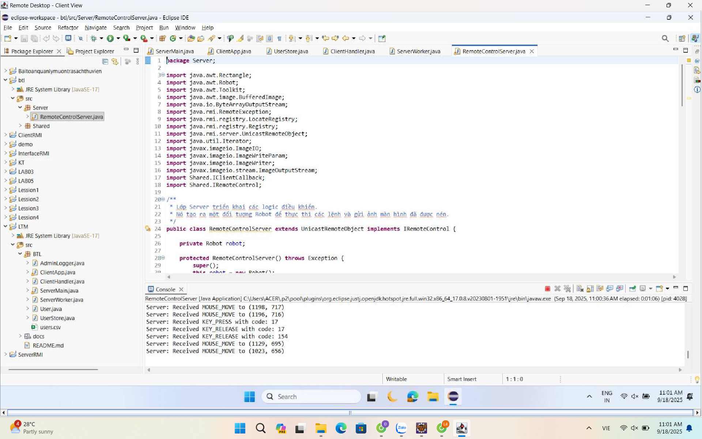
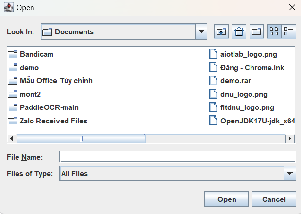
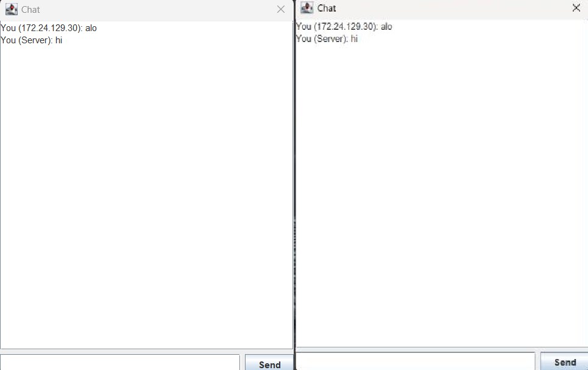
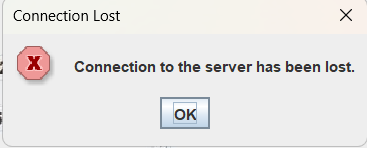

<h2 align="center">
    <a href="https://dainam.edu.vn/vi/khoa-cong-nghe-thong-tin">
    🎓 Faculty of Information Technology (DaiNam University)
    </a>
</h2>
<h2 align="center">
    ỨNG DỤNG ĐIỀU KHIỂN MÁY TÍNH TỪ XA (REMOTE CONTROL) 
</h2>

    

        
        
        
    

# 📖 1. Giới thiệu hệ thống
## Ứng dụng điều khiển máy tính từ xa (Remote Control)

Ứng dụng cho phép người dùng **truy cập, theo dõi và điều khiển máy tính từ xa** thông qua mạng **LAN**.

## 🖥️ Kiến trúc hệ thống
- **Máy chủ (Remote Server)**  
  - Là máy tính bị điều khiển.  
  - Chia sẻ màn hình theo thời gian thực.  
  - Tiếp nhận và thực thi các lệnh điều khiển (chuột, bàn phím) từ Client.  

- **Máy khách (Remote Client)**  
  - Là máy tính điều khiển.  
  - Hiển thị màn hình từ xa.  
  - Gửi thao tác chuột, bàn phím đến Server.  

## 🚀 Tính năng chính
- Xem toàn bộ màn hình máy tính từ xa.  
- Thao tác chuột và bàn phím như ngồi trực tiếp trước máy.  
- Giao diện đơn giản, dễ sử dụng.  
- Có thể mở rộng thêm:
  - Bảo mật và xác thực người dùng.  
  - Kết nối qua Internet (WAN).  

## 🛠️ Ứng dụng
- **Làm việc từ xa (Remote Work).**  
- **Quản trị hệ thống & server.**  

## 📂 Cấu trúc project (tham khảo)

---

# 🛠️ 2. Công nghệ sử dụng

Ứng dụng dựa trên các công nghệ của **Java SE**

---

## 2.1. Java RMI (Remote Method Invocation) 🖥️➡️🖥️
- **Vai trò**:  
  Cho phép Client gọi phương thức từ xa trên Server như thể chạy cục bộ → đơn giản hóa giao tiếp mạng so với Socket.  
- **Ứng dụng**:  
  - Client gọi các hàm: `mouseMove()`, `keyPress()` để gửi lệnh điều khiển.  
  - Server sử dụng callback `receiveScreen()` để gửi ảnh màn hình về Client.  

## 2.2. Java AWT 📸🖱️
- **Vai trò**:  
  - **Chụp ảnh màn hình** trên Server.  
  - **Mô phỏng điều khiển**: thao tác chuột, bàn phím.  
- **Lớp chính**:  
  - `java.awt.Robot`: tạo sự kiện bàn phím, chuột và chụp màn hình.  

## 2.3. Java Image I/O & AWT Image 🎨
- **Vai trò**:  
  - **Nén ảnh**: Chuyển `BufferedImage` thành `byte[]` (JPEG) để truyền qua mạng.  
  - **Giải nén & hiển thị**: chuyển dữ liệu ảnh nhận được để hiển thị trên Client.  
- **Các lớp chính**:  
  - `javax.imageio.ImageIO`: đọc/ghi ảnh.  
  - `java.awt.image.BufferedImage`: biểu diễn ảnh trong bộ nhớ.  
  - `java.awt.Image`: lớp cơ sở cho đối tượng hình ảnh.  

## 2.4. Java Thread ⚙️
- **Vai trò**: xử lý song song, tránh treo ứng dụng.  
- **Ứng dụng**:  
  - Server chạy một luồng riêng để **chụp & gửi ảnh màn hình liên tục**.  
  - Đồng thời vẫn nhận lệnh điều khiển từ Client.  
- **Lớp chính**:  
  - `java.lang.Thread`: tạo và quản lý luồng thực thi.  

---

# 🚀 3. Hình ảnh các chức năng

    

        
    

    
Hình 1: Giao diện dự án

 

    

        
    

    
Hình 2: Client đã kết nối và điều khiển Server từ xa

 

    

        
    

    
Hình 3: Gửi file từ Client đến Server

 

    

        
    

    
Hình 4: Chat giữa 2 máy

 

    

        
    

    
Hình 5: UI khi Server ngắt kết nối

 

---

# 📝 4. Hướng dẫn cài đặt và sử dụng
## ⚙️ 4.1. Yêu cầu hệ thống
- **JDK 8+**
- **Eclipse IDE** (hoặc bất kỳ IDE hỗ trợ Java)
- **Mạng LAN/Wi-Fi** với 2 máy tính (1 Server + 1 Client)

---

## 🚀 4.2. Cài đặt
1. Tạo project mới trong Eclipse:  
   **File → New → Java Project → RemoteControlRMI**
2. Tạo các package:
   - `shared`
   - `server`
   - `client`
3. Tạo file:
   - `shared/IClientCallback.java`
   - `shared/IRemoteControl.java`
   - `server/RemoteControlServer.java`
   - `client/RemoteControlClient.java`
4. Dán mã nguồn vào các file trên.
5. Build project (**Project → Clean...** nếu cần).

---

## ▶️ 4.3. Cách sử dụng

### 🔹 Trên Máy A (Server - Bị điều khiển)
1. Chạy `client/MainUI.java`.
2. Ứng dụng hiển thị **Your ID (IP)** và **Password**.
3. Gửi thông tin này cho người điều khiển.

### 🔹 Trên Máy B (Client - Điều khiển)
1. Chạy `client/MainUI.java`.
2. Nhập **Partner ID (IP)** của Máy A.
3. Nhấn **Connect to partner**.

### 🔹 Kết nối thành công
- Máy B sẽ hiển thị màn hình Máy A.
- Có thể sử dụng chuột + bàn phím để điều khiển Máy A từ xa.  

#### ✅ Bây giờ bạn đã có thể **điều khiển máy tính từ xa** qua mạng LAN/Internet.
---

# 📞 5. Liên hệ
- **Họ tên:** Lê Hải Đăng  
- **Lớp:** CNTT 16-04  
- **Email:** dangngoc1122004@gmail.com  
- **Zalo:** 0377968152  
---

## © 2025 AIoTLab, Faculty of Information Technology, DaiNam University. All rights reserved.
