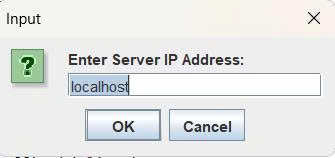

<h2 align="center">
    <a href="https://dainam.edu.vn/vi/khoa-cong-nghe-thong-tin">
    🎓 Faculty of Information Technology (DaiNam University)
    </a>
</h2>
<h2 align="center">
    ỨNG DỤNG ĐIỀU KHIỂN MÁY TÍNH TỪ XA (REMOTE CONTROL) 
</h2>
<div align="center">
    <p align="center">
        
        
        
    </p>

[](https://www.facebook.com/DNUAIoTLab)
[](https://dainam.edu.vn/vi/khoa-cong-nghe-thong-tin)
[](https://dainam.edu.vn)

</div>

# 📖 1. Giới thiệu hệ thống
## Ứng dụng điều khiển máy tính từ xa (Remote Control)

Ứng dụng cho phép người dùng **truy cập, theo dõi và điều khiển máy tính từ xa** thông qua mạng **Internet hoặc LAN**.

## 🖥️ Kiến trúc hệ thống
- **Máy chủ (Remote Server)**  
  - Là máy tính bị điều khiển.  
  - Chia sẻ màn hình theo thời gian thực.  
  - Tiếp nhận và thực thi các lệnh điều khiển (chuột, bàn phím) từ Client.  

- **Máy khách (Remote Client)**  
  - Là máy tính điều khiển.  
  - Hiển thị màn hình từ xa.  
  - Gửi thao tác chuột, bàn phím đến Server.  

## 🚀 Tính năng chính
- Xem toàn bộ màn hình máy tính từ xa.  
- Thao tác chuột và bàn phím như ngồi trực tiếp trước máy.  
- Giao diện đơn giản, dễ sử dụng.  
- Có thể mở rộng thêm:
  - Bảo mật và xác thực người dùng.  
  - Kết nối qua Internet (WAN).  

## 🛠️ Ứng dụng
- **Làm việc từ xa (Remote Work).**  
- **Quản trị hệ thống & server.**  

## 📂 Cấu trúc project (tham khảo)

---

# 🛠️ 2. Công nghệ sử dụng

Đề tài chủ yếu dựa trên các công nghệ của **Java Platform, Standard Edition (Java SE)**:

---

### 2.1. Giao tiếp mạng: Java RMI (Remote Method Invocation) 🖥️➡️🖥️
- **Vai trò**:  
  Cho phép Client gọi các phương thức trên đối tượng của Server từ xa như thể đang chạy cục bộ. Đơn giản hóa lập trình mạng so với dùng Socket.  
- **Ứng dụng trong hệ thống**:  
  - Client gọi các hàm như `mouseMove()`, `keyPress()` để gửi lệnh điều khiển.  
  - Server dùng callback gọi `receiveScreen()` trên Client để đẩy dữ liệu hình ảnh về.  

### 2.2. Giao tiếp mạng: Java RMI (Remote Method Invocation) 🖥️➡️🖥️
- **Vai trò**:  
  Cho phép Client gọi các phương thức trên đối tượng của Server từ xa như thể đang chạy cục bộ. Đơn giản hóa lập trình mạng so với dùng Socket.  
- **Ứng dụng trong hệ thống**:  
  - Client gọi các hàm như `mouảnh: Java Image I/O và AWT Image 🎨
- **Vai trò**:  
  - Nén ảnh: Chuyển `BufferedImage` thành mảng `byte[]` (JPEG) để gửi qua mạng.  
  - Hiển thị ảnh: Chuyển đổi dữ liệu ảnh nhận được để hiển thị mượt mà trên Client.  
- **Các lớp đã dùng**:  
  - `javax.imageio.ImageIO`: Đọc/ghi các định dạng ảnh.  
  - `java.awt.image.BufferedImage`: Biểu diễn ảnh trong bộ nhớ.  
  - `java.awt.Image`: Lớp cơ sở cho đối tượng đồ họa hình ảnh.  
### 2.3. Điều Khiển & Chụp Màn Hình: Java AWT 📸🖱️
- **Vai trò**:  
  - **Chụp ảnh màn hình**: Ghi lại hình ảnh hiện tại trên màn hình Server.  
  - **Mô phỏng điều khiển**: Thực hiện lệnh di chuyển chuột, nhấn chuột, gõ phím.  
- **Lớp chính**:  
  - `java.awt.Robot`: Tạo sự kiện đầu vào (chuột, bàn phím) và chụp màn hình.  

### 2.4. Xử Lý Hình Ảnh: Java Image I/O và AWT Image 🎨
- **Vai trò**:  
  - Nén ảnh: Chuyển `BufferedImage` thành mảng `byte[]` (JPEG) để gửi qua mạng.  
  - Hiển thị ảnh: Chuyển đổi dữ liệu ảnh nhận được để hiển thị mượt mà trên Client.  
- **Các lớp đã dùng**:  
  - `javax.imageio.ImageIO`: Đọc/ghi các định dạng ảnh.  
  - `java.awt.image.BufferedImage`: Biểu diễn ảnh trong bộ nhớ.  
  - `java.awt.Image`: Lớp cơ sở cho đối tượng đồ họa hình ảnh.  

### 2.5. Lập trình đa luồng: Java Thread ⚙️
- **Vai trò**: Cho phép thực hiện nhiều tác vụ song song, tránh treo ứng dụng.  
- **Ứng dụng trong hệ thống**:  
  - Server chạy một luồng riêng để **chụp & gửi màn hình liên tục** cho Client.  
  - Vẫn đảm bảo Server có thể nhận lệnh điều khiển đồng thời.  
- **Lớp chính**:  
  - `java.lang.Thread`: Tạo và quản lý luồng thực thi mới.  

---

# 🚀 3. Hình ảnh các chức năng
<div align="center">
    <p align="center">
        
    </p>
</div> 
---
# 📝 4. Hướng dẫn cài đặt và sử dụng
## 📋 4.1 Môi trường yêu cầu

- **Java Development Kit (JDK):** Phiên bản 8 trở lên.  
- **Môi trường lập trình (IDE):** Eclipse IDE for Java Developers (hoặc bất kỳ IDE nào hỗ trợ Java).  
- **Mạng:** Hai máy tính (1 Server, 1 Client) kết nối cùng mạng LAN (ví dụ: cùng Wi-Fi).  

---

## ⚙️ 4.2 Các bước cài đặt

### Bước 1: Tạo dự án trong Eclipse
1. Mở Eclipse → **File → New → Java Project**.  
2. Đặt tên dự án, ví dụ: `RemoteControlRMI` → **Finish**.  

### Bước 2: Tạo các package cần thiết
1. Trong **Package Explorer**, chuột phải vào thư mục `src` của dự án.  
2. Chọn **New → Package**.  
3. Tạo 3 package:  
   - `shared`  
   - `server`  
   - `client`  

### Bước 3: Tạo file Java và thêm mã nguồn
- Trong package `shared`:  
  - Tạo `IClientCallback.java` (Interface).  
  - Tạo `IRemoteControl.java` (Interface).  
- Trong package `server`:  
  - Tạo `RemoteControlServer.java` (Class).  
- Trong package `client`:  
  - Tạo `RemoteControlClient.java` (Class).  
- **Dán mã nguồn** vào các file tương ứng.  

### Bước 4: Xây dựng dự án
- Eclipse thường tự động biên dịch mã.  
- Để chắc chắn, vào menu: **Project → Clean...** để dọn dẹp và build lại.  

---

## ▶️ 4.3 Hướng dẫn sử dụng

Ứng dụng chạy trên **2 máy tính**:  
- **Máy A (Server/Host):** bị điều khiển.  
- **Máy B (Client):** điều khiển từ xa.  

### Bước 1: Chạy Server trên Máy A

1. Mở dự án trong Eclipse.  
2. Tìm địa chỉ IP của Máy A:  
   - Mở **Command Prompt (CMD)**.  
   - Gõ lệnh:  

     ```bash
     ipconfig
     ```  
   - Ghi lại địa chỉ ở dòng **IPv4 Address** (ví dụ: `192.168.1.10`).  
3. Trong Eclipse, chạy file **`server/RemoteControlServer.java`**:  
   - Chuột phải → **Run As → Java Application**.  
4. Khi thành công, cửa sổ Console sẽ hiển thị:

### Bước 2: Chạy Client trên Máy B

1. Mở dự án trong Eclipse trên Máy B.  
2. Chạy file **`client/RemoteControlClient.java`**:  
- Chuột phải → **Run As → Java Application**.  

### Bước 3: Kết nối Client với Server

1. Sau khi chạy Client, một hộp thoại sẽ hiện lên yêu cầu nhập địa chỉ IP.  
2. Nhập địa chỉ IP của Máy A (ví dụ: `192.168.1.10`) và nhấn **OK**.  
3. Nếu kết nối thành công:  
- Cửa sổ trên Máy B sẽ hiển thị **màn hình của Máy A**.  
- Bạn có thể sử dụng **chuột và bàn phím** trên Máy B để điều khiển Máy A từ xa, giống như ngồi trực tiếp trước máy.  

#### ✅ Bây giờ bạn đã có thể **điều khiển máy tính từ xa** qua mạng LAN/Internet.
---

# 📞 5. Liên hệ
- **Họ tên:** Lê Hải Đăng  
- **Lớp:** CNTT16-04  
- **Email:** dangngoc1122004@gmail.com  
- **Zalo:** 0377968152  
---


© 2025 AIoTLab, Faculty of Information Technology, DaiNam University. All rights reserved.
